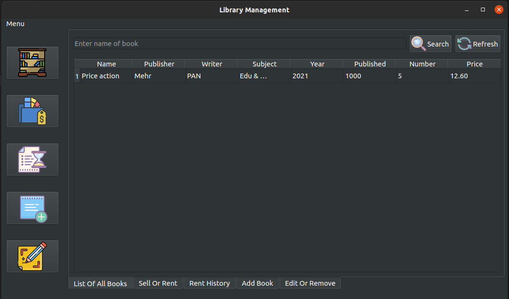
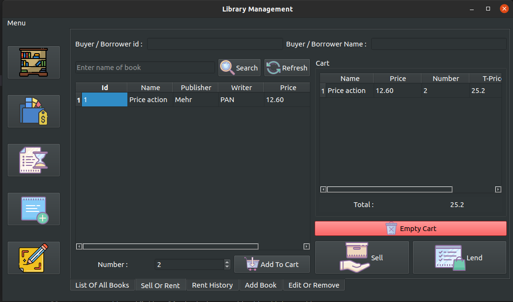
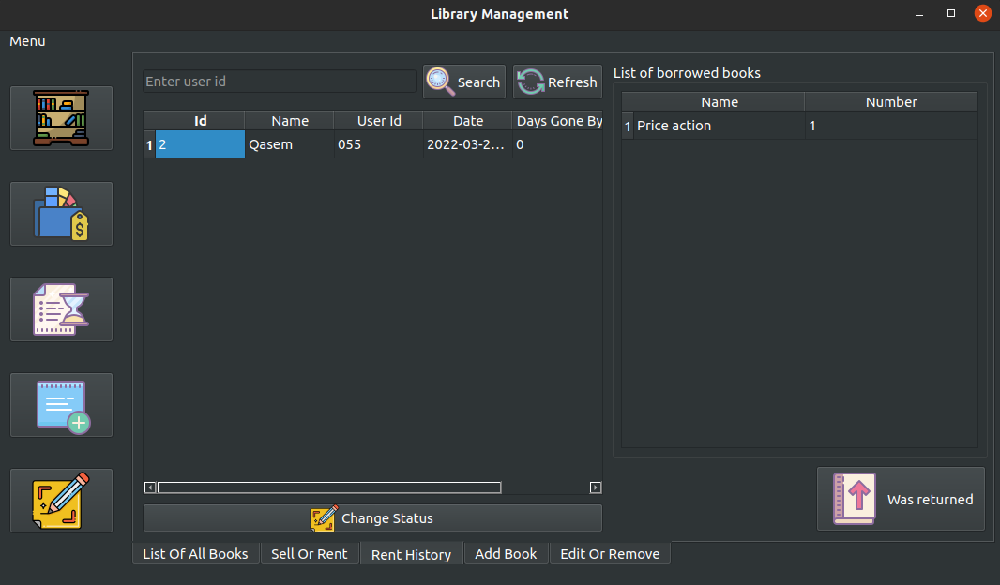
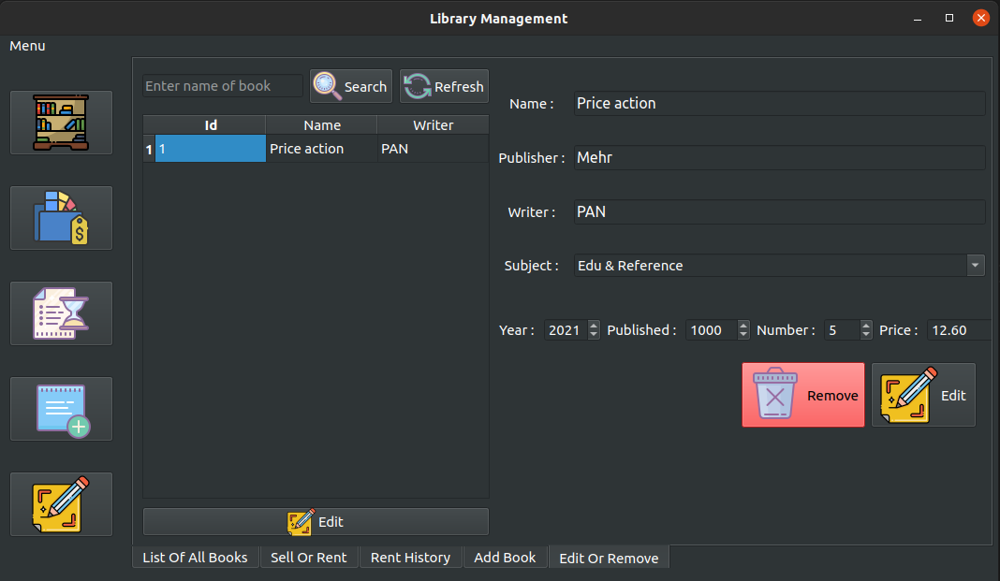

# Library management software

All information is stored in the Sqlite database. In the software, books can be added, edited or deleted, sold or rented.
Leased books can be managed with either the user name and ID.

## Installation
First install these packages : 
```bash
sudo apt install python3-pip python3-venv python3-pyqt5
```
Then download source code and in source code folder :
```bash
python3 -m venv ./venv
source ./venv/bin/activate
pip install -r req.txt
```
Finally run it : 
```bash
python3 main.py
```

## Screenshots









